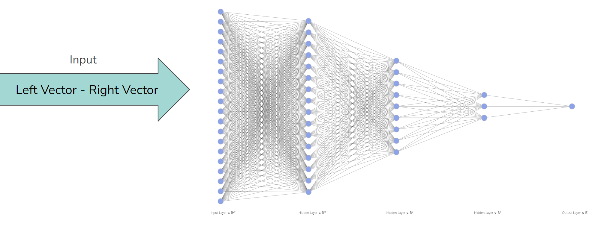

# moral_machine
This is a final Project for COG415 at The University of Toronto.
This project uses the Moral Machine data set by Awad et al, 2018

# Disclaimer
This project explores the development and use of a moral
decision-making AI that assigns value to specific char-
acters. This model should not be used to inform real-
world moral decisions nor are the conclusions of the pa-
per representative of objective values of human life. The
purpose of this paper is academic exploration and an
attempt to model human moral reasoning.

# Project Motivation
Human ethical judgements are complex and nuanced

Primary goal: To develop a model that can simulate human moral judgments in ethical dilemmas

We want to capture the complex interplay of factors that influence moral decisions
Goals:
- Formalizing ethics computationally
- Understanding morality judgments, especially in ethical dilemmas, is crucial for fields like psychology, and philosophy
- AI Alignment
- Model how cognitive moral judgments are made
- How do we value and prioritize human life? → triage algorithms, automated weapons, self-driving cars

# Data Set
Used the Moral Machine Data set.

The input was the vector of the characters on each side of the scenario.

Used a random sample of 350,000 scenarios ~10% of the data set. 

# Model Architecture
5-layer Neural Network with an input cardinality of 20 and a binary output of [0, 1],
- Used the sigmoid activation function
- Used Mean Squared error as our loss function 
- Used SGD as an optimier

# Navigating This Repo
The file that was used to train the network is in the Networks folder and is called ColabNetwork. It is coded to work on google 
collab and required access to a GPU. 

The Logistic regression is also in the Network folder.

All of the data that was used is in the Data Folder and all the functions that files that were used to clean and generate the file are in the 
Data Cleaning folder. Note: to run the data cleaning file you will need to change the file paths.

The Results folder contains the following items:
- feature analysis file
- the functions used to test the model after it was trained
- the visualisation file where the majourity of the visualisations were generated
- A file containing the trained model that can be downloaded and used using the Pytorch library with the implemtations
that are present in the ColabNetwork.ipynb file. 

